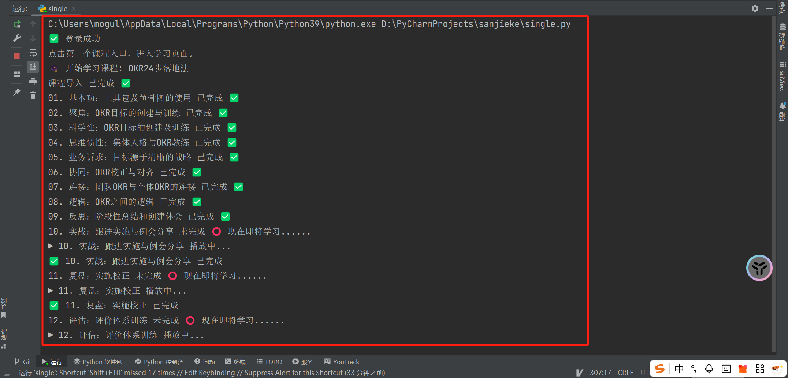

# Sanjieke 视频自动学习脚本

## 功能说明
该脚本使用 Selenium 自动登录“三节课”学习平台，自动遍历课程列表，进入每个课程页面，并依次播放未完成的小节，直到标记为完成。

主要功能包括：
- 自动登录指定账号。
- 获取所有课程入口链接，并依次打开。
- 在每个课程页面点击“开始学习”按钮。
- 遍历课程小节：
  - 如果小节已完成，则跳过。
  - 如果未完成，则点击播放按钮并轮询状态，直到小节完成。
  - 包含两种不同的课程类型，一种是嵌套的课程，如第一部分下边有十个章节；另一种是单独的类型，在包含这两种类型的课程中刷课时会首先刷嵌套的然后再刷非嵌套的课程
- 完成当前课程后关闭标签页，返回主页面继续下一个课程。
- 代码有两种模式：1、全量执行，即每次执行代码是都是冲第一个开始的；2、单个课程执行；两种不同模式的执行文件分别为study_course.py和single.py
- **注意事项**：
  - 请抱着代码学习的态度来学习，而不是其他目的
  - 在config.ini文件中配置自己的账号和密码 
  - 注意谷歌浏览器和ChromeDriver的版本对应
  - 如果电脑性能较低或网络不稳定，脚本可能运行缓慢或出现页面加载异常。
  - 脚本中 `time.sleep()` 用于等待页面加载或播放状态刷新，数值可根据电脑和网络性能调整：
    - 电脑性能好、网络稳定：可适当减少 `time.sleep()` 时间，加快运行速度。
    - 电脑性能一般或网络慢：保持原来的等待时间，避免页面元素未加载完成导致报错。
  - 脚本只能模拟播放视频、增加观看时长、模拟观看时长达到总时间的70%时可以完成本课程的学习。
  - 平台服务器有多重校验机制，目前无法通过直接提交post请求的方式短时间完成。
  - 目前通过率大概在80-90%，有些校验目前还无法绕开，需要手动在网页校验
- **版本更新**：
  - 20250828 
    - 更新刷课基础功能
  - 20250829 
    - 更新倍速播放功能，比原来快40%左右
    - 更新绕开部分校验功能
  - 20250830
    - 优化视频播放规则，已完成视频不会进行点击
  - 20250831
    - 更新滑动条未能滚动到目标区域，导致播放失败的问题
    - 增加静音功能
- **如下方式执行**：
  - 
- **操作演示**:
  - 执行代码后自动打开浏览器自动播放视频
  - 
---

## 环境依赖
- Python 3.9
- Selenium
- Chrome 浏览器
- ChromeDriver 对应版本

安装依赖：
```bash
pip install selenium
pip install configparser